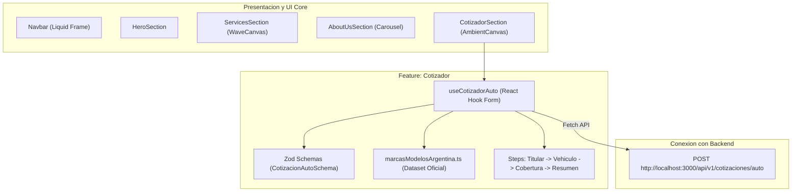

<div align="center">
  
  
  # SecureLife • Frontend Platform
  
  <p align="center">
    <strong>Plataforma Insurtech moderna para cotización, peritaje digital y emisión de pólizas en tiempo real.</strong>
  </p>

  <p align="center">
    <a href="#inicio-rápido">Inicio Rápido</a> •
    <a href="#arquitectura-feature-based">Arquitectura</a> •
    <a href="#características-principales">Características</a> •
    <a href="./DESIGN.md">Design System (DESIGN.md)</a> •
    <a href="#scripts-disponibles">Comandos</a> •
    <a href="#licencia">Licencia</a>
  </p>

  <p align="center">
    
    
    
    
    
    
    
  </p>
</div>

---

## Resumen del Proyecto

**SecureLife Frontend** es la aplicación web pública y portal de usuarios de SecureLife. Combina una interfaz cinemática y fluida con validación estricta de formularios y conexión directa con el motor actuarial de backend para generar cotizaciones de seguros en segundos, sin intermediarios ni papeleo burocrático.

> [!TIP]
> Desarrollado bajo los estándares de **React Clean Architecture (Feature-Based)** y optimizado para el motor V8, garantizando 60fps constantes en microinteracciones y cero fugas de memoria en el ciclo de vida de los componentes.

---

## Características Principales

* **Cotizador Automotor en Tiempo Real:** Asistente paso a paso (Wizard) de 4 etapas que calcula primas mensuales oficiales llamando al backend REST `POST /api/v1/cotizaciones/auto`.
* **Catálogo Oficial de Autos de Argentina:** Base de datos interactiva con más de 20 marcas oficiales (Toyota, Volkswagen, Fiat, Ford, Chevrolet, Renault, etc.) y filtrado dependiente de modelos oficiales (Cronos, Hilux, 208, Amarok, Cruze).
* **Marco Líquido Dinámico (Navbar Liquid Frame):** Barra de navegación flotante con indicador elástico continuo que rastrea la sección activa (`#hero`, `#servicios`, `#sobre-nosotros`, `#cotizador`) sin reinicios abruptos.
* **Experiencia Visual Cinemática:** Fondo animado con ondas sinusoidales (`WaveCanvas`), constelaciones geométricas (`GeometryCanvas`) y canvas ambiental de partículas luminosas (`CotizadorAmbientCanvas`).
* **Entrada Táctil de Marca (Intro Loader):** Apertura cinemática de candado con GSAP que desbloquea la vista sin bloquear el scroll tras finalizar.
* **Componentes Reciclables:** Librería interna (`Button`, `Card`, `Badge`, `Input`) con contratos universales (`variant`, `width`, `height`, `className`, `children`, `icons`).

---

## Arquitectura Feature-Based



### Estructura de Directorios

```text
src/
├── components/
│   ├── ui/                   # Componentes atómicos reutilizables (Button, Card, Badge, Input)
│   ├── layout/               # Elementos estructurales (Navbar con marco líquido, Footer)
│   └── animations/           # Canvas interactivos (WaveCanvas, GeometryCanvas, CotizadorAmbientCanvas, PageIntroLoader)
├── features/
│   ├── landing/              # Pantalla principal y secciones (HeroSection, ServicesSection, AboutUsSection, CotizadorSection)
│   └── cotizador/            # Módulo de cotizaciones
│       ├── components/       # Pasos del wizard (PasoTitular, PasoVehiculo, PasoCobertura, PasoResumen)
│       ├── data/             # Marcas y modelos oficiales comercializados en Argentina
│       ├── hooks/            # Custom Hook useCotizadorAuto (estado asíncrono y validación)
│       ├── types/            # Esquemas Zod y contratos de datos tipados
│       └── utils/            # Motor de cálculo local de contingencia y formateo ARS
├── types/                    # Tipos globales de la aplicación
└── index.css                 # Configuración Tailwind CSS v4 (@theme, tokens corporativos y fuentes)
```

---

## Inicio Rápido

### Prerrequisitos
* **Node.js:** `>= 20.0.0`
* **npm:** `>= 10.0.0`

### 1. Clonar el Repositorio
```bash
git clone https://github.com/tu-organizacion/SecureLife_FrontEnd.git
cd SecureLife_FrontEnd
```

### 2. Instalar Dependencias
```bash
npm install
```

> [!NOTE]
> En entornos **Windows PowerShell**, si la directiva de ejecución bloquea scripts (`PSSecurityException`), invoca las utilidades anteponiendo `cmd /c` (ej: `cmd /c npm install` o `cmd /c npx vite`).

### 3. Iniciar el Servidor de Desarrollo
```bash
npm run dev
```
La aplicación se levantará de forma instantánea en `http://localhost:5173/`.

### 4. Compilar para Producción
```bash
npm run build
```
Genera los artefactos optimizados en la carpeta `dist/` con análisis de tipos TypeScript (`tsc -b`).

---

## Design System & Tokens

La identidad visual está unificada en `src/index.css` mediante la directiva `@theme` de Tailwind v4:

> [!TIP]
> Para consultar la especificación detallada de tokens, catálogo completo de componentes reciclables (`src/components/ui/`), reglas de glassmorphism y directrices de conversión desde Google Stitch AI / Figma, revisa el documento maestro: **[DESIGN.md](./DESIGN.md)**.

| Token | Color | Valor Hex | Uso Principal |
| :--- | :---: | :---: | :--- |
| `--color-primary` |  | `#006e2f` | Verde corporativo para botones de acción y títulos |
| `--color-accent` |  | `#22c55e` | Verde esmeralda para brillos líquidos, halos y badges |
| `--color-surface` |  | `#f8f9ff` | Fondo base ultra-limpio con matiz frío |
| `--color-dark` |  | `#0b1c30` | Azul petróleo de alto contraste para textos y tarjetas |

### Tipografías Oficiales
* **Títulos (`font-title`):** *Google Sans Flex* (pesos 700 a 900).
* **Subtítulos y Badges (`font-subtitle`):** *Outfit* (pesos 500 y 600).
* **Cuerpo de Texto e Inputs (`font-body`):** *Lexend* (pesos 300 a 500).

---

## Scripts Disponibles

| Comando | Descripción |
| :--- | :--- |
| `npm run dev` | Inicia el servidor de desarrollo Vite con Hot Module Replacement (HMR). |
| `npm run build` | Compila TypeScript (`tsc -b`) y empaqueta la aplicación con Vite para producción. |
| `npm run preview` | Previsualiza localmente el build de producción generado en `dist/`. |
| `npm run lint` | Ejecuta el linter rápido de Oxlint sobre el código fuente. |

---

## Testing y Calidad de Código

El proyecto aplica tipado estricto sin concesiones:
* Cero tolerancia a `any` o conversiones inseguras de tipo (`as`).
* Inferencia automática de formularios mediante `z.infer<typeof CotizacionAutoSchema>`.
* Manejo seguro de estados asíncronos mediante uniones discriminadas (`idle`, `loading`, `success`, `error`).

---

## Licencia

Distribuido bajo la Licencia **MIT**. Consulta el archivo `LICENSE` para más información.
