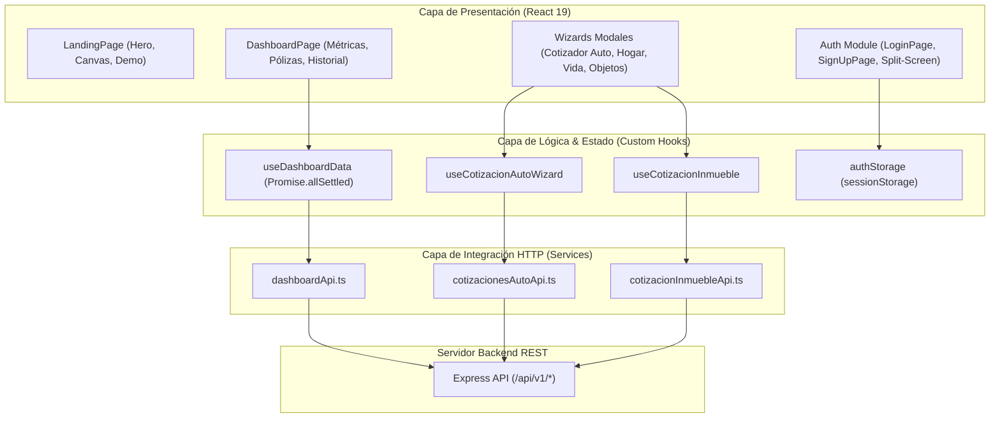

<div align="center">
  

  # SecureLife - Frontend Platform

  <p align="center">
    <strong>Plataforma Insurtech de alta disponibilidad para asegurados: cotización multirramo en tiempo real, inspección pericial digital, gestión integral de pólizas y auxilio satelital 24/7.</strong>
  </p>

  <p align="center">
    <a href="#resumen-del-proyecto">Resumen</a> •
    <a href="#modulos-y-capacidades-del-sistema">Módulos</a> •
    <a href="#arquitectura-feature-based">Arquitectura</a> •
    <a href="#design-system-y-tokens">Tokens de Diseño</a> •
    <a href="#variables-de-entorno">Variables de Entorno</a> •
    <a href="#inicio-rapido">Inicio Rápido</a> •
    <a href="#scripts-disponibles">Comandos</a> •
    <a href="#seguridad-y-sesion">Seguridad</a> •
    <a href="#licencia">Licencia</a>
  </p>

  <p align="center">
    
    
    
    
    
    
    
    
  </p>
</div>

---

## Resumen del Proyecto

**SecureLife Frontend** es la plataforma web para asegurados y cotizantes de SecureLife. Construida bajo los principios de **React Clean Architecture (Feature-Based)** y optimizada para el motor V8 de los navegadores modernos, ofrece una interfaz interactiva de alta fidelidad, animaciones cinemáticas fluidas a 60 fps mediante GSAP y validación preventiva con Zod.

El sistema se conecta de forma directa a la API REST de SecureLife y al motor relacional PostgreSQL 16 para reflejar cálculos actuariales deterministas, coberturas contratadas, emisión de solicitudes y seguimiento satelital de asistencias mecánicas en tiempo real.

> [!NOTE]
> **Persistencia Efímera y Segura:** En cumplimiento estricto con las directivas de seguridad para aplicaciones financieras, la sesión del asegurado se conserva de forma exclusiva en `sessionStorage` mediante el servicio `authStorage`, garantizando que credenciales y tokens JWT se eliminen al cerrar la pestaña del navegador sin dejar residuos en disco.

---

## Módulos y Capacidades del Sistema

### 1. Dashboard del Asegurado (`/dashboard`)
* **Métricas Reales por Vistas SQL:** Consume datos consolidados del backend (`v_dashboard_active_policies`, `v_client_audit_log`) para reflejar suma total asegurada, inversión mensual y siniestros abiertos.
* **Pólizas Activas en Detalle:** Tarjetas interactivas con coberturas contratadas, patentes o domicilios asegurados, carnet de seguro digital y acceso directo al botón de auxilio mecánico.
* **Auxilio Vial Satelital 24/7:** Valida estrictamente en base de datos la vigencia de una póliza automotor activa antes de despachar la solicitud de remolque o grúa.
* **Estados Vacíos Guiados:** Flujos amigables que guían al usuario hacia los wizards de cotización en caso de no poseer coberturas contratadas.

### 2. Autenticación Split-Screen Solara (`/login` y `/signup`)
* **Identificador Dual:** Inicio de sesión unificado que acepta indistintamente **correo electrónico** o **número de DNI** argentino (7 u 8 dígitos numéricos).
* **Protección de Rutas (`ProtectedRoute`):** Middleware en cliente que verifica el estado de autenticación y previene accesos no autorizados a las vistas privadas.
* **Formularios con Tipado Estricto:** Validación reactiva paso a paso mediante React Hook Form y esquemas Zod con retroalimentación visual inmediata.

### 3. Cotizador de Automotores (Wizard en 4 Pasos)
* **Doble Flujo de Cotización:**
  * **Catálogo Oficial (ACARA / DNRPA):** Selección de marca, modelo y año con tasación automatizada de suma asegurada y cálculo actuarial de planes (Responsabilidad Civil, Terceros Completo y Todo Riesgo).
  * **Carga Manual (Revisión Extensa):** Para vehículos clásicos, especiales o importados no catalogados, permitiendo valor declarado y derivación a peritaje manual.
* **Inspección Pericial Digital:** Carga obligatoria de 7 fotos perimetrales (frente, laterales, trasera con patente, parabrisas, neumáticos y odómetro) y documentación legal (cédula verde y registro de conducir).

### 4. Cotizador de Hogar e Inmuebles (`HOGAR_INMUEBLE`)
* **Tipología y Superficie:** Selección entre Casa, Departamento, PH, Barrio Cerrado o Local Comercial con estimación automática de costo de reposición por metro cuadrado.
* **Bonificaciones por Seguridad:** Descuento directo en la prima mensual ante la presencia de alarmas monitoreadas, cámaras de seguridad y rejas perimetrales.
* **Inspección Digital del Inmueble:** Carga interactiva de fotos de fachada exterior con numeración visible, cerramientos y comprobante de titularidad.

### 5. Cotizador de Vida y Objetos Personales
* Coberturas patrimoniales para dispositivos tecnológicos (notebooks, smartphones, cámaras) y seguros de vida individual con designación estructurada de beneficiarios.

### 6. Simulador Demostrativo en Landing Page
* Cotizador demostrativo accesible para visitantes que permite simular pólizas y visualizar tarifas preliminares antes de iniciar el registro formal.

---

## Arquitectura Feature-Based



### Estructura de Directorios

```text
SecureLife_FrontEnd/
├── public/                    # Logotipos oficiales SVG, isotipos y favicons
├── src/
│   ├── components/
│   │   ├── ui/                # Componentes atómicos reciclables (Button, Input, Card, Badge)
│   │   ├── layout/            # Navbar con marco líquido y Footer corporativo
│   │   └── animations/        # Canvas interactivos y transiciones GSAP
│   ├── features/              # Módulos organizados por dominio de negocio
│   │   ├── auth/              # Formularios de autenticación, esquemas Zod y authStorage
│   │   ├── landing/           # Landing page pública y cotizador demostrativo
│   │   ├── cotizador/         # Simulador paramétrico para visitantes
│   │   └── dashboard/         # Portal privado del asegurado
│   │       ├── components/    # MetricCard, PolicyCard, ActivityFeed
│   │       ├── components/cotizacion-auto/     # Wizard de 4 pasos para automotores
│   │       ├── components/cotizacion-inmueble/ # Wizard de 4 pasos para inmuebles
│   │       ├── components/cotizacion-vida/     # Wizard para seguros de vida
│   │       ├── components/cotizacion-objeto/   # Wizard para objetos personales
│   │       ├── hooks/         # Custom Hooks con gestión asíncrona tipada
│   │       ├── services/      # Clientes HTTP hacia los endpoints REST
│   │       └── pages/         # DashboardPage.tsx
│   ├── types/                 # Contratos e interfaces de dominio TypeScript
│   ├── App.tsx                # Configuración de rutas principales y ProtectedRoute
│   ├── index.css              # Tokens de diseño Tailwind CSS v4 (@theme)
│   └── main.tsx               # Entrada de la aplicación React 19
├── package.json               # Dependencias y scripts de ejecución
├── tsconfig.json              # Configuración base de TypeScript
└── vite.config.ts             # Configuración de Vite y plugins oficiales
```

---

## Design System y Tokens

La identidad corporativa está gobernada por Tailwind CSS v4 en `src/index.css`:

| Token | Variable CSS | Valor Hex | Aplicación |
| :--- | :--- | :---: | :--- |
| `primary` | `--color-primary` | `#006e2f` | Verde corporativo para botones principales, cabeceras e isotipo |
| `accent` | `--color-accent` | `#22c55e` | Verde esmeralda para halos líquidos, bordes activos y estados positivos |
| `surface` | `--color-surface` | `#f8f9ff` | Fondo base ultra-limpio con matiz frío |
| `dark` | `--color-dark` | `#0b1c30` | Azul petróleo de alto contraste para textos y marcos estructurales |

* **Fuentes Oficiales:** *Google Sans Flex* (Títulos y cabeceras), *Outfit* (Subtítulos, badges y acentos), *Lexend* (Cuerpo de texto, datos y campos de formulario).

---

## Variables de Entorno

Configura estas variables en tu entorno de ejecución o archivo `.env`:

| Variable | Descripción | Tipo | Default | Requerido |
| :--- | :--- | :---: | :---: | :---: |
| `VITE_API_URL` | URL base de la API REST de Backend de SecureLife | String | `http://localhost:3000/api/v1` | No |

---

## Inicio Rápido

### Prerrequisitos
* **Node.js:** Versión `>= 20.0.0`
* **npm:** Versión `>= 10.0.0`
* **Backend:** Instancia de `SecureLife_BackEnd` ejecutándose en `http://localhost:3000`.

### Paso 1: Clonar y Acceder al Directorio
```bash
git clone https://github.com/Ixion-Systems/SecureLife_FrontEnd.git
cd SecureLife_FrontEnd
```

### Paso 2: Instalar Dependencias
```powershell
cmd /c npm install
```

> [!NOTE]
> En entornos Windows PowerShell, ejecuta los comandos anteponiendo `cmd /c` para evitar inconvenientes relacionados con restricciones de scripts (`PSSecurityException`).

### Paso 3: Iniciar Servidor de Desarrollo
```powershell
cmd /c npm run dev
```

La aplicación se iniciará de inmediato en `http://localhost:5173/` con recarga ultrarrápida vía Vite HMR.

---

## Scripts Disponibles

| Comando | Descripción |
| :--- | :--- |
| `cmd /c npm run dev` | Inicia el servidor de desarrollo de Vite con Hot Module Replacement (HMR). |
| `cmd /c npm run build` | Valida tipos de TypeScript (`tsc -b`) y compila el bundle de producción en `dist/`. |
| `cmd /c npm run preview` | Levanta un servidor web local para inspeccionar la versión compilada en `dist/`. |
| `cmd /c npm run lint` | Ejecuta el análisis estático de código ultra-rápido con Oxlint. |

---

## Seguridad y Sesión

* **Erradicación de localStorage:** Tokens JWT y datos de perfil residen en `sessionStorage`. Al cerrar la pestaña del navegador, la sesión concluye inmediatamente.
* **Control de Inactividad y Expiración:** Si cualquier llamada a la API devuelve un código HTTP `401 Unauthorized`, el cliente purga la sesión activa y redirige al usuario a la vista de login.
* **Validación Preventiva con Zod:** Sanitización y validación tipada en cliente de cada paso en los wizards de cotización antes del envío de datos a los endpoints REST.

---

## Licencia

Distribuido bajo la Licencia **MIT**. Consulta el archivo `LICENSE` para más información.

<div align="center">
  <sub>Copyright 2026 SecureLife Seguros S.A. Todos los derechos reservados.</sub>
</div>
